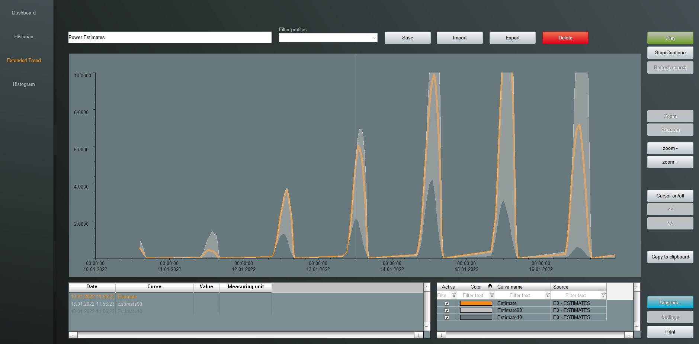
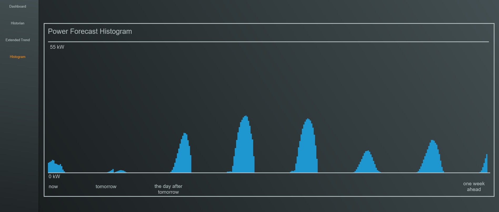

# Solar Power Forecast

This project uses the GenericNET driver to provide solar power forecast data from the SolCast REST API to zenon. This is an example project and can be extended for your own use.

# How to use
Register an account at solcast.com and create a site. Enter all the data necessary for your power plant. Note the site id and the API key.

Download the sources for the GenericNET driver extension. Configure the ```ApiKey``` and ```SiteId``` in the file ```Constants.cs``` of the SolCast project.
(I know that this could be done in a configuration file but I wanted to keep the example simple for now.)

```csharp
  public static class Constants
  {
    public static string ApiKey => "HjIJ576mSuPPeUP3kC_wioGKxyd6f4dR";
    public static string SiteId => "e1eb-2eb1-42f9-96e9"; //Copa-Data Headquarter
    public static string BaseUrl => "https://api.solcast.com.au/";
    public static string GetRooftopSitesForecastUrl => "rooftop_sites/{0}/forecasts";

  }
```

>  ___Note:___ The ```SolCast``` project also includes some test data (from january 2022) which you can use for a quick try. Make sure to define/uncomment/comment the according lines in the code. No registration at solcast.com is needed.

The driver queries new data every 3 hours and buffers the last data. So when the variables are advised, the values of the last query is written to these variables. 
(I just assumted that the forecast data doesn't change so frequently. As the SolCast API limits the number of requests per day this is also usefult to not over use the free subscription. Of course, the frequency of the requests can be changed in the code)

Build the GenericNET driver extension and copy it to the according directory of your zenon installation. An instruction on how to install the extension is given in the [GenericNET driver documentation](https://github.com/COPA-DATA/DriverExtensions/wiki).

# zenon Project
In this repository you'll find also an example zenon project (backup). The minimal zenon version is 10.

## Variables
The GenericNET driver extension accomodates several variables. These variables need to have a special name or rather symbolic address for the GenericNET driver extension to write the correct values on them.
* ```WeatherForecastActive```: This boolean variable activates the forecast. If it is set to ```false``` the solcast query is disabled. A value of  ```true``` activates the data query from solcast. This is the only variable which can be written from zenon.

The variables for the forecast data can only be read and are separated into two groups:
### Continous values
For continous variables The driver extension sets the data with the according timestamp in the future. These variables can be used to save them in a spontanous archive. 
> ___Note___: Because the values of a certain data point in the future can change (the forecast for wednesday isn't the same on monday than it is on tuesday), the archive saves multiple values for the same point in time. 

* ```Estimate```: This variable is the 'best guess' of the power output on a certain point in time.
 * ```Estimate10```: This variable is the 'lower bound' of the power output on a certain point in time. With a certainity of 90% more power is generated. 
 * ```Estimate90```: This variable is the 'upper bound' of the power output on a certain point in time. With a certainity of 90% less power is generated. 

 Displaying the forecasted power curve could look like this in extended trend:
 
 

### Discrete values
It is assumted, that the latest forecast value for a certain time point is also the most accurate. As the zenon archive keeps track of all the forecasted values of that timepoint, it could be somewhat hard to identify the last forecasted value.

Therefore the driver extension sets the last forecasted value to a set of 336 variables (7 days * 24 hours * 2 data points per hour = 336). These variable follow the naming:
* ```estimate_n```

...where n is a number from 0 to 335. The value on the variable ```estimate_0``` is the best forecast for the current date and time. ```estimate_1``` is the best forecast for the next half hour. ```estimate_2``` is the best forecast for the time __now + 30 minutes__ to __now + 60 minutes__ and so on.

These values can be displayed in some sort of a histogram:




